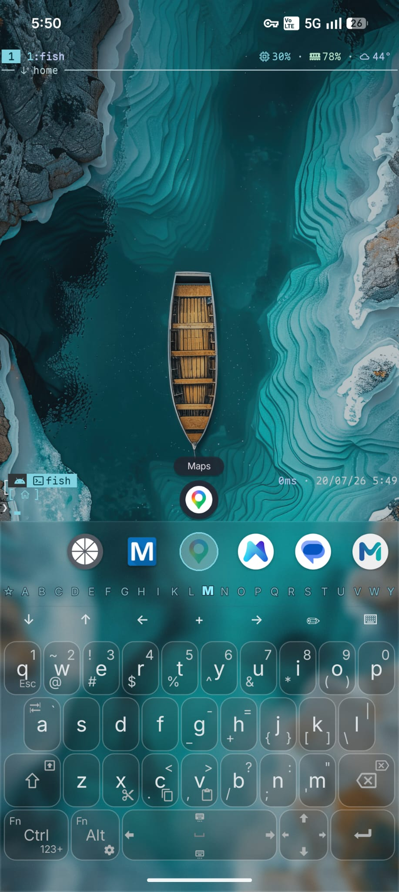
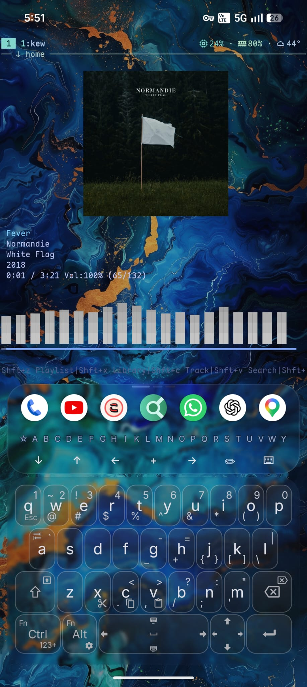

# Termux Launcher site: design spec

Status: approved direction, 2026-09-27. This file is the single source of truth for the
glassmorphic overhaul. Workers build from it; reviewers check against it. Decisions in
"Fixed decisions" are final and are not to be re-opened.

## 1. Concept

**The site behaves like the launcher.** The app is a frosted terminal and keyboard floating
over a wallpaper (AGSL blur on Android 13+). The site quotes that literally:

- A fixed, slowly drifting wallpaper layer sits behind everything.
- A film-grain overlay sits on top of everything.
- Every surface is glass: translucent fill, 1px light hairline, thin top highlight, backdrop
  blur.
- The phone is the one solid object on the page. The About scroll story revolves around it.

Reading surfaces (Docs, migration page) share the tokens and the wallpaper but stay
calm: fade-up reveals only, no pinning, no tilt.

## 2. Fixed decisions

| Question | Answer |
|---|---|
| Motion stack | GSAP 3.15 + ScrollTrigger from jsdelivr, loaded in `index.html`. No Lenis, no smooth-scroll library. Vanilla CSS for hovers and reveals. |
| Wallpaper | Generated aurora gradient mesh, CSS only. Teal with a faint violet tint, slow drift, grain on top. No image asset. |
| Scope | About view gets the full treatment. Docs gets glass tokens and calm motion. `migrate-vaj.html` gets the shared nav, wallpaper and tokens. |
| Display font | Geist (Google Fonts) for headings. Body stays IBM Plex Sans, mono stays IBM Plex Mono. |
| Scroll behaviour | Scroll-linked (scrub) only. Never scroll-jacking, never `preventDefault` on wheel/touch. |
| Media | Assets in `assets/`, plus new media made for the docs rework (section 15): the tour infographic and new captures listed in `MEDIA_TODO.md`. No stock. A page with no media yet ships text-first, never with a placeholder. |

## 3. Tokens

All tokens live on `:root` in `styles.css`. The inline `style` on `#tl` in both HTML files and
the `!important` re-declaration block in `styles.css` (around line 691) are deleted. Legacy
aliases stay so untouched selectors keep working.

```css
:root {
  /* palette: three hues only */
  --bg: #080b0d;
  --bg2: #0b1012;
  --text: #e2e7ef;
  --mute: #98a2af;
  --dim: #5a6470;
  --accent: #72d8cd;
  --accent-b: #a5eee7;
  --accent-rgb: 114, 216, 205;
  --accent-soft: rgba(var(--accent-rgb), 0.09);
  --accent-line: rgba(var(--accent-rgb), 0.34);
  --violet-rgb: 96, 72, 150;          /* wallpaper tint only, never on UI */

  /* status colours, unchanged, used only in code/API tables */
  --green: #7fd18c; --cyan: #63c2d4; --orange: #e0a072; --red: #e07070;

  /* legacy aliases kept for the wiki/AI selectors */
  --panel: rgba(255, 255, 255, 0.04);
  --panelink: rgba(8, 11, 13, 0.72);
  --ink: rgba(8, 11, 13, 0.6);
  --line: rgba(255, 255, 255, 0.09);
  --line2: rgba(255, 255, 255, 0.06);
  --blue: var(--accent); --blue-b: var(--accent-b); --blue-soft: var(--accent-soft); --bline: var(--accent-line);
  --gold: var(--accent); --gold-b: var(--accent-b); --gold-soft: var(--accent-soft); --gline: var(--accent-line);
  --cream: var(--text);

  /* glass */
  --glass-fill: rgba(255, 255, 255, 0.045);
  --glass-fill-strong: rgba(255, 255, 255, 0.07);
  --glass-fill-dense: rgba(14, 20, 23, 0.86);   /* mobile replacement for blur */
  --glass-line: rgba(255, 255, 255, 0.10);
  --glass-highlight: rgba(255, 255, 255, 0.18);
  --glass-blur: 18px;
  --glass-radius: 18px;
  --glass-radius-sm: 12px;
  --glass-shadow: 0 1px 0 rgba(255,255,255,0.04) inset, 0 20px 60px rgba(0,0,0,0.35);

  /* type */
  --display: 'Geist', 'IBM Plex Sans', system-ui, sans-serif;
  --sans: 'IBM Plex Sans', system-ui, sans-serif;
  --mono: 'IBM Plex Mono', ui-monospace, monospace;

  /* layout */
  --nav-h: 64px;
  --gutter: clamp(16px, 4vw, 40px);
  --content-max: 1200px;
  --reading-max: 1000px;
}
```

Gold `#f1c95f` (focus ring at the top of `styles.css`) and the amber `::selection` are replaced
by the accent. Nothing on the page may use a hue outside teal, off-white, off-black. Violet
exists only inside the wallpaper mesh.

## 4. Glass recipe

One class, applied everywhere a surface exists (nav, cards, chapters, sidebar, code blocks,
tables, footer):

```css
.glass {
  position: relative;
  background: var(--glass-fill);
  border: 1px solid var(--glass-line);
  border-radius: var(--glass-radius);
  box-shadow: var(--glass-shadow);
  backdrop-filter: blur(var(--glass-blur)) saturate(140%);
  -webkit-backdrop-filter: blur(var(--glass-blur)) saturate(140%);
}
.glass::before {               /* top highlight, 1px, fades out to the sides */
  content: ""; position: absolute; inset: 0 12% auto 12%; height: 1px;
  background: linear-gradient(90deg, transparent, var(--glass-highlight), transparent);
  pointer-events: none;
}
.glass--strong { background: var(--glass-fill-strong); }
.glass--sm { border-radius: var(--glass-radius-sm); }

/* Mobile frame rate: blur only on fixed/sticky surfaces below 720px. */
@media (max-width: 720px) {
  .glass:not(.glass--fixed) {
    backdrop-filter: none; -webkit-backdrop-filter: none;
    background: var(--glass-fill-dense);
  }
}
```

`.glass--fixed` is for the nav and the pinned phone frame only. Scrolling cards never carry
backdrop blur below 720px.

## 5. Wallpaper and grain

Markup, first children of `#site-shell` in `index.html` and of `#tl` in `migrate-vaj.html`:

```html
<div class="wallpaper" aria-hidden="true">
  <i class="wallpaper-blob wallpaper-blob--1"></i>
  <i class="wallpaper-blob wallpaper-blob--2"></i>
  <i class="wallpaper-blob wallpaper-blob--3"></i>
  <i class="wallpaper-blob wallpaper-blob--4"></i>
</div>
<div class="grain" aria-hidden="true"></div>
```

Rules:

- `.wallpaper` is `position: fixed; inset: 0; z-index: 0; overflow: hidden; background: var(--bg)`.
  Content sits in `#tl` with `position: relative; z-index: 1`. Grain is `position: fixed;
  z-index: 50; pointer-events: none`, SVG `feTurbulence` data URI at opacity 0.045 (the
  awwwards-hero blueprint). Nav z-index stays above grain (60).
- Blobs are large `radial-gradient` ellipses (soft falloff, no `filter: blur`, so nothing
  expensive repaints). Three teal blobs at 0.16 to 0.22 alpha, one violet blob at 0.10 alpha.
  Sizes 55vw to 80vw. `will-change: transform` on blobs only.
- Drift is transform-only, Lissajous style: each blob gets two `alternate infinite` keyframe
  animations on separate axes with mismatched durations (X 23s, Y 31s; X 29s, Y 37s; etc.) using
  `var(--ease-in-out)`. Nothing faster than 20s. The mesh must look still at a glance and alive
  after a few seconds.
- Reduced motion: blobs have `animation: none`. Grain stays (it is static).
- No canvas, no JS for the wallpaper.

## 6. Typography

| Role | Face | Spec |
|---|---|---|
| Hero H1 | Geist 600 | `font-size: clamp(2.75rem, 7.2vw, 7.5rem); letter-spacing: -0.035em; line-height: 0.94; text-wrap: balance;` max 3 lines at 1440. The phrase "a terminal." is IBM Plex Mono 500, same size, accent colour, followed by a blinking block cursor. |
| Section H2 | Geist 600 | `clamp(1.9rem, 3.6vw, 3.4rem)`, `-0.025em`, line-height 1.02 |
| Statement lines (What it is) | Geist 500 | `clamp(1.5rem, 2.8vw, 2.6rem)`, `-0.02em`, line-height 1.15, max-width 26ch |
| Chapter titles, card titles | Geist 600 | 1.25rem to 1.5rem, `-0.01em` |
| Eyebrow / rules / meta | IBM Plex Mono 500 | 0.72rem, `letter-spacing: 0.14em`, uppercase, `--mute` |
| Body | IBM Plex Sans 400 | 1rem to 1.0625rem, line-height 1.6, `--mute` for supporting copy, `--text` for primary |
| Docs prose H1/H2/H3 | Geist 600 | H1 `clamp(2rem, 3.5vw, 2.9rem)`; H2 1.6rem; H3 1.2rem |

Google Fonts link (replace the existing one in both HTML files):
`https://fonts.googleapis.com/css2?family=Geist:wght@500;600;700&family=IBM+Plex+Mono:wght@400;500;600;700&family=IBM+Plex+Sans:wght@400;500;600;700&display=swap`

Body copy is never Geist. Mono is never used for paragraphs.

## 7. Easing palette and timing

Defined once on `:root`. CSS keyword easings (`ease`, `ease-in`, `ease-out`, `ease-in-out`)
are banned everywhere except `linear` on infinite loops (marquee, cursor blink, gradient
border). `transition: all` is banned.

```css
:root {
  --spring-snappy: linear(0, 0.009, 0.035 2.1%, 0.141 4.4%, 0.723 12.9%, 0.938 16.7%, 1.017 19.4%, 1.067 22.5%, 1.089 26.0%, 1.079 30.3%, 1.049 36.0%, 1.024 42.6%, 1.011 50.3%, 1.004 59.2%, 1.001 69.3%, 1);
  --spring-smooth: linear(0, 0.004, 0.016 2.3%, 0.063 4.7%, 0.141 7.2%, 0.25 9.9%, 0.601 16.5%, 0.815 21.0%, 0.929 25.2%, 0.987 29.0%, 1.025 33.5%, 1.042 38.0%, 1.04 43.5%, 1.027 50.0%, 1.013 57.5%, 1.005 67.0%, 1.001 79.0%, 1);
  --ease-out: cubic-bezier(0.16, 1, 0.3, 1);      /* fallback for spring-snappy, and for secondary reveals */
  --ease-in-out: cubic-bezier(0.65, 0, 0.35, 1);  /* ambient, colour, wallpaper */
  --ease-snap: cubic-bezier(0.22, 1, 0.36, 1);    /* hover */
  --ease-dramatic: cubic-bezier(0.77, 0, 0.175, 1); /* the one theatrical moment: hero words */
}
@supports not (animation-timing-function: linear(0, 1)) {
  :root { --spring-snappy: var(--ease-out); --spring-smooth: var(--ease-in-out); }
}
```

GSAP equivalents: `power3.out` for entries, `power2.inOut` for position changes, `none` for
scrubbed timelines.

Timing sheet:

| Element | Trigger | Delay | Duration | Easing | Transform |
|---|---|---|---|---|---|
| Nav | load | 0 | 600ms | --ease-out | opacity 0→1, y -12→0 |
| Hero eyebrow | load | 80ms | 600ms | --ease-out | opacity, y 16→0, blur 6→0 |
| Hero H1 words | load | 140ms + 55ms per word | 700ms | --ease-dramatic | masked y 110%→0 |
| Hero CTA | load | 420ms | 550ms | --spring-snappy | opacity, y 16→0, scale 0.96→1 |
| Hero strip | load | 500ms | 550ms | --ease-out | opacity, y 12→0 |
| Hero phone | load | 120ms | 780ms | --ease-out | y 22vh→0, rotate 8°→6°, opacity 0→1 |
| Section headings | scroll, 20% visible | 0 | 800ms | --spring-snappy | opacity, y 32→0 |
| Statement lines | scroll | 0/100/200ms | 800ms | --ease-dramatic | masked y 100%→0 |
| Chapter cards | scroll, 15% visible | 0 | 700ms | --spring-snappy | opacity, y 28→0 |
| Edition cards | scroll | 0/90/180ms | 700ms | --spring-snappy | opacity, y 28→0 |
| Footer items | scroll | 0/80/160/240ms | 600ms | --ease-out | opacity, y 16→0 |
| Buttons | hover | 0 | 450ms | --ease-snap | y -2px, shadow |
| Buttons | active | 0 | 100ms | --ease-snap | scale 0.98 |
| Cards | hover | 0 | 400ms | --ease-snap | y -4px, border → accent-line |
| Links | hover | 0 | 350ms | --ease-snap | underline scaleX 0→1 from left |
| Nav active indicator | view change | 0 | 400ms | --spring-smooth | translateX + width |
| Docs TOC indicator | spy change | 0 | 350ms | --ease-snap | translateY |

Rules: total hero entry finishes under 800ms (last element starts by 500ms, all settle by
~1050ms including the phone tail, which is acceptable because it is below the copy). Stagger
80 to 150ms. No reveal over 900ms. Stagger at most six items; from the seventh onward items
reveal together.

## 8. Reduced motion

Every animation, CSS or GSAP, is gated. Under `prefers-reduced-motion: reduce`:

- Reveals become opacity-only, 250ms, no transform, no blur, no delay.
- Wallpaper drift, marquee, gradient border rotation, cursor blink: `animation: none`.
- GSAP: `motion.js` checks `matchMedia` at start and again on change, and does not create
  ScrollTriggers, tilt or the pinned phone at all. `html.has-motion` is not set, so the CSS
  fallback layout (each chapter carries its own shot) applies.
- The blanket `* { animation-duration: 0.01ms !important }` block at the bottom of
  `styles.css` is removed and replaced by the targeted rules above.

## 9. About view, section by section

Order: Nav, Hero, Spine (10 additions), What it is, Install, Docs ticker, Footer. The
`about-explainer` section moves from second to fourth position.

### 9.1 Nav (`.site-nav`, shared by all views and by the migration page)

Glass pill, `position: sticky; top: 12px`, max-width 1120px, centred, `--nav-h` tall, class
`glass glass--fixed`. Brand left, three view tabs centre, GitHub + Install right. The active
tab is styled via `[aria-current="page"]` (app.js already sets it). A sliding indicator
`.nav-indicator` (absolute, 1px tall or a soft pill background) moves between tabs; motion.js
positions it. Links: underline slide. `scrollToId` in app.js reads `--nav-h` plus 24px.

### 9.2 Hero (awwwards-hero Architecture A, Cinematic Center)

Fits one viewport at 1440x900. Layout: `min-height: 100dvh`, grid rows `auto 1fr auto`, copy
centred, phone rising from the bottom edge, strip pinned to the bottom.

```html
<section class="hero" data-hero>
  <div class="hero-copy">
    <p class="hero-eyebrow" data-hero-item>An Android home app built on Termux</p>
    <h1 class="hero-title" data-hero-item aria-label="Your home screen is a terminal.">
      <span class="word-mask"><span class="word">Your</span></span>
      <span class="word-mask"><span class="word">home</span></span>
      <span class="word-mask"><span class="word">screen</span></span>
      <span class="word-mask"><span class="word">is</span></span>
      <span class="word-mask"><span class="word hero-title-mono">a terminal.<i class="hero-cursor" aria-hidden="true"></i></span></span>
    </h1>
    <a class="hero-cta btn btn--primary" data-hero-item data-scrollto="tl-install" href="#setup">Get the APK</a>
  </div>
  <div class="hero-phone" data-phone>
    <div class="phone-frame glass glass--fixed">
      <video class="phone-video" src="assets/screen-20260803-124853-web.mp4" poster="assets/screen-recording-poster.jpg" muted autoplay loop playsinline preload="metadata" width="720" height="1608" aria-label="Termux Launcher workflow screen recording"></video>
      
      <!-- clock, kew, notify, rainbow, settings likewise -->
    </div>
  </div>
  <div class="hero-strip" data-hero-item>
    <span data-release-tag="PickleHik3/termux-launcher:main">latest release</span>
    <span>GPL-3.0-only</span>
    <span>Android 8+</span>
  </div>
</section>
```

- The eyebrow is uppercase via CSS, not in the markup.
- Word masks: `.word-mask { display:inline-block; overflow:hidden; vertical-align:bottom; padding-bottom:0.06em }`, `.word { display:inline-block; transform: translateY(110%) }`. CSS reveals them on `html.is-loaded` (set by motion.js on `DOMContentLoaded`, or by an inline `<script>` in `<head>` that adds the class immediately so a missing motion.js never leaves the hero blank). If `html` lacks `.has-motion`, words are visible immediately.
- Block cursor: `.hero-cursor { display:inline-block; width:0.55em; height:0.95em; margin-left:0.12em; background: var(--accent); vertical-align:-0.08em; animation: tl-blink 1.1s steps(1) infinite }`.
- ONE CTA. The old "Install guide" and "GitHub ↗" hero buttons are removed. The old
  `.hero-terminal` typewriter block and `[data-terminal-line]` are removed (app.js tolerates
  their absence).
- Phone: 300 to 340px wide at desktop, frame radius 38px, 8px glass bezel, `rotate(6deg)`
  at rest in the hero, bottom edge below the fold (about 35% of the phone hidden). The video
  and shots are stacked with `position:absolute; inset:0; object-fit:cover`; the video is on
  top with `opacity:1`, shots `opacity:0`. motion.js swaps them during the spine.
- Strip: mono, `--dim`, dots between items. Live tag hook `data-release-tag` must stay.
- No "scroll to explore", no chevrons, no badges, no version label except the live tag in
  the strip.

Mobile (< 768px): copy top-aligned with 12vh top padding, H1 min 2.5rem, phone 62vw wide,
no tilt, strip wraps.

### 9.3 Spine: the 10 additions (the wow moment)

```html
<section class="spine" data-spine>
  <div class="spine-head">
    <p class="rule">On top of official Termux <span></span> 10 additions</p>
  </div>
  <div class="spine-grid">
    <ol class="spine-chapters">
      <li class="chapter glass" data-chapter="01" data-shot="kew">
        <em>01</em>
        <h3>Terminal</h3>
        <p>Sixel + Kitty graphics, Kitty fonts and shaping, animated cursor, TUI-aware touch</p>
        
      </li>
      <!-- 02..10 -->
    </ol>
    <div class="spine-phone-slot" data-phone-slot aria-hidden="true"></div>
  </div>
</section>
```

Chapter → shot mapping (fixed):

| # | Title | Shot |
|---|---|---|
| 01 | Terminal | kew |
| 02 | In-app multiplexer | home |
| 03 | In-app status bar | clock |
| 04 | Command palette | home |
| 05 | In-app keyboard | rainbow |
| 06 | Quick reply | notify |
| 07 | App drawer + dock | home |
| 08 | Material themes | rainbow |
| 09 | Shizuku integration | settings |
| 10 | Local LLM backends | settings |

Copy for each chapter is the existing text in `index.html` (the `about-additions` articles).

Layout ≥ 900px: two columns, `minmax(0, 1fr) 360px`, gap 64px. Chapters stack on the left,
each `min-height: 62vh` so one chapter is "current" at a time, `scroll-margin-top` set.
`.spine-phone-slot` is `position: sticky; top: calc(var(--nav-h) + 40px)`, width 300px,
aspect 9/19.5, and is empty. It marks where the phone sits; motion.js moves the hero phone
onto it.

Behaviour with motion (`html.has-motion`):
1. ScrollTrigger A (trigger `[data-hero]`, start `top top`, end `bottom top`, scrub 0.6):
   hero copy and strip fade to 0 and drift up 40px; phone rotates 6° → 0° and scales 1 → 0.9.
2. ScrollTrigger B pins `[data-phone]` (`pin: true, pinSpacing: false`) from the point the
   spine slot reaches its sticky top until the last chapter's bottom hits the slot's bottom.
   During the pin, a scrubbed tween translates the phone from its hero position to the slot's
   bounding box (computed in a function so `invalidateOnRefresh` re-measures on resize).
   Alternative allowed: skip `pin` and keep the phone in the hero, positioning it with a
   scrubbed transform calculated against the slot's rect, provided the phone never jumps at
   the hand-off and never lags the slot by more than a few px at rest.
3. One ScrollTrigger per chapter (start `top center`, end `bottom center`, `toggleClass:
   "is-current"` on the chapter, `onToggle` → crossfade the phone to `data-shot`). The video
   fades out at chapter 01, shots crossfade 350ms via opacity only, the video fades back in
   after chapter 10 (below the spine the phone is released and scrolls away with the section).
4. `.chapter-shot` is `display: none` when `html.has-motion` and the viewport is ≥ 900px.

Behaviour without motion (no JS, reduced motion, or < 900px): the hero phone stays in the
hero as a normal element; `.spine-phone-slot` is `display: none`; each chapter shows its own
`.chapter-shot` at the right of the card (≥ 560px) or below the text (< 560px), 120px wide,
rounded 14px.

Chapter card: glass, 28px padding, `em` in mono `--accent` 0.8rem, H3 Geist, P `--mute`.
`.is-current` chapter: border → `--accent-line`, `em` → `--accent-b`, slight
`translateX(6px)`. Cards get the standard scroll reveal.

### 9.4 What it actually is

Three statement lines, each a `p.statement` wrapped in `.line-mask` (overflow hidden), revealed
with a masked slide-up on scroll, staggered 100ms. Copy is the existing three paragraphs
condensed by the worker to one sentence each, kept factual, no marketing words:

1. "It starts from Termux and makes it the thing your home button opens. `pkg`, the repos and everything you know keep working."
2. "On top: a multiplexer with pinch zoom per pane, Sixel and Kitty graphics, and a command palette that reaches every launcher feature."
3. "And it stays a launcher: dock and drawer, quick replies from the terminal, Material colours from your wallpaper, local models over an OpenAI-compatible API."

Section rule above: "What it actually is". No card, no glass; the lines sit directly on the
wallpaper with a 1px hairline (`.divider`, scaleX 0→1 reveal) between the rule and the lines.

### 9.5 Install (`#tl-install`, id must stay)

Rule "Install <span></span> one APK", H2 "Pick an edition, then set it as home.", lead
paragraph unchanged. Three `.edition-card.glass[data-tilt]` in a 3-column grid (1 column
< 820px). Recommended card gets `.gradient-border`: a conic gradient of accent → transparent
→ accent-b → transparent, rotating 8s linear via `@property --gradient-angle`, masked to a 1px
ring (padding-box/border-box mask, not a nested wrapper), so the card's own glass and hooks
are untouched. Reduced motion: static accent border.

Tilt: cursor-tracking, max 6°, `perspective(900px)`, transform-only, mouse only, disabled
under reduced motion and on touch (`hover: none`). Card body lifts 4px on hover.

All existing hooks stay verbatim: `data-release-link`, `data-release-tag` (both editions and
the vaj edition), `data-article` buttons, the three `.install-next-grid` items (restyled as a
glass strip with three columns), the `migrate-vaj.html` link (as a normal styled link, no inline
style).

### 9.6 Docs ticker

Replaces `about-docs-links`. H2 "Screenshots, keybinds and the rest are in the docs." above a
full-bleed `.marquee` with `.marquee-inner` containing the six `button[data-article]` topics
duplicated once for the seamless loop (the duplicates get `aria-hidden="true"` and
`tabindex="-1"`). Speed 36s linear, pauses on hover and on focus-within. Edge fades use the
wallpaper background colour at 0 alpha → `--bg`. Each item is a glass pill; hover lifts.
Reduced motion: no animation, items wrap as a normal row.

### 9.7 Footer

Glass strip, same content and links as today, inline styles moved to classes (`.site-footer`,
`.site-footer-brand`, `.site-footer-links`). Items get `data-reveal-stagger`.

## 10. Reveal system (shared by all views)

```html
<div data-reveal>…</div>            <!-- fade-up, 32px -->
<div data-reveal="blur">…</div>     <!-- fade-up + blur 6px→0 -->
<div data-reveal-stagger>…</div>    <!-- children stagger 80ms, first six only -->
```

CSS carries the hidden and visible states (opacity/transform/filter only, `--spring-snappy`,
800ms). motion.js adds `.is-visible` with one IntersectionObserver (threshold 0.15,
rootMargin `-40px 0px`, unobserve after first hit). Hidden state applies only under
`html.has-motion`, so without JS everything is visible.

Because views are shown/hidden with `display`, motion.js re-observes on every
`tl:viewchange` event (see section 12) and calls `ScrollTrigger.refresh()` after the view
switch has painted (double `requestAnimationFrame`).

## 11. Docs and the migration page

- Same nav, wallpaper, grain, tokens, `.glass` surfaces, reveal system. No pin, no tilt, no
  marquee, no gradient border.
- Wiki sidebar (`.wiki-sidebar`): glass rail, sticky under the nav. Article buttons lose
  their inline styles and get `.wiki-article-button`; the active one uses the existing
  active class/attribute from `showArticle` plus a 2px accent bar on the left that slides
  between items (`.wiki-sidebar-indicator`, positioned by motion.js like the nav indicator).
- `.wiki-toc-col`: glass, sticky. Active TOC entry gets a sliding indicator too.
- `.wiki-prose`: H1/H2/H3 Geist, code blocks and tables become `.glass--sm` surfaces. Clip
  figures from `upgradeWikiClips` keep their markup; their frame gets `.glass--sm`.
- `migrate-vaj.html`: adopts the new `<head>` (Geist link, new cache-bust), the wallpaper
  and grain markup, the glass nav (it has no view tabs; the tabs container stays empty), and
  `.migration-hero`, `.migration-timeline`, `.migration-coexist` become glass. It loads no
  JS, so it must look complete with every reveal visible (it never gets `html.has-motion`).

2026-09-28: the top-level "Termux AI" view (`data-view="ai"`, nav tab, `#ai-*`/`#ep-*` ids, the
`.ai-*`/`.api-*` class set, `buildEndpointReference` and friends in app.js) was folded into Docs
as two wiki pages, [On-device AI](_wiki/on-device-ai.md) and
[On-device AI API](_wiki/on-device-ai-api.md), and the feature was renamed "On-device AI"
everywhere user-facing (the `tai` CLI name is unchanged). The site now has two views: About and
Docs.

## 12. Contracts between files

app.js (already done in the main session before delegation):

- `setView` toggles `[data-view]` with `display` and sets `aria-current="page"` on the active
  nav tab; the inline colour/background writes are gone. After switching it dispatches
  `document.dispatchEvent(new CustomEvent("tl:viewchange", { detail: { view, subview } }))`.
- `scrollToId` offsets by `--nav-h` + 24px read from the root style.

index.html `<head>` (already done):

```html
<script src="https://cdn.jsdelivr.net/npm/gsap@3.15.0/dist/gsap.min.js" defer></script>
<script src="https://cdn.jsdelivr.net/npm/gsap@3.15.0/dist/ScrollTrigger.min.js" defer></script>
```
and at the end of `<body>`, after `app.js`: `<script src="motion.js?v=…" defer></script>`.

motion.js (Worker B) owns:

- `html.has-motion` (added only when GSAP loaded, `matchMedia("(prefers-reduced-motion: reduce)")`
  is false, and `(hover: hover)` or width ≥ 900px as appropriate per feature) and
  `html.is-loaded` (added on DOMContentLoaded regardless, drives the hero entry CSS).
- Hero entry timeline, hero → spine phone choreography, chapter triggers and shot swaps,
  reveal observer, tilt, nav and sidebar indicators, `ScrollTrigger.refresh()` on
  `tl:viewchange`, resize (debounced) and `load`.
- It reads only the selectors in this document. It never writes inline styles other than
  `transform`/`opacity` (and what GSAP sets), never touches app.js state, never adds scroll
  listeners (ScrollTrigger and IntersectionObserver only).

styles.css and index.html (Worker A) own every selector named above and must produce the DOM
exactly as specified, including the data attributes, so motion.js binds without changes.

## 13. Preserve list (must not break)

- Jekyll: empty front matter on both HTML files, Liquid loop over `site.wiki`, `markdownify`,
  `baseurl` unaffected (all asset paths stay relative).
- Hooks: `[data-view]`, `[data-nav]`, `[data-scrollto]`, `[data-article]`, `[data-anchor]`,
  `[data-copy]`, `[data-cmd]`, `[data-cmd-text]`, `[data-release-tag]`, `[data-release-link]`,
  `[data-article-body]`, `[data-article-meta]`, `[data-wiki-content]`, `[data-wiki-toc]`,
  `[data-spy]`, `[data-eplist]`, `[data-epdetail]`, `[data-autoplay]`, `[data-wval]`,
  `.wiki-sidebar button[data-article]`, `.wiki-prose`, `#tl-install`, `#setup-downloads`,
  `#tour` may go.
- Keyboard: `/`, `1`, `2`, `3` in app.js untouched.
- `admin/` and `oauth-worker/` untouched.
- Copy: no new marketing words ("seamless", "elevate", "unleash", "next-gen"), no emojis, no
  em-dashes in new copy (existing copy in the wiki is out of scope).

## 14. Acceptance checklists

Hero (awwwards-hero Phase 4): one focal point; fits 1440x900 without scrolling to find the
CTA; H1 ≤ 3 lines; Geist, negative tracking, line-height < 1; max 3 hues; grain + glow
atmosphere; one CTA; no scroll indicator; entry < 800ms; reduced motion honoured; nothing
animates `top/left/width/height`; clean collapse < 768px; no horizontal overflow; 44px tap
targets.

Motion (awwwards-motion Phase 4): every heading, paragraph, card, button, link, image,
section, divider and footer item has an entry or reveal and, where interactive, a hover and
focus-visible state; zero keyword easings; transform/opacity/filter/clip-path only; blur
only on fixed/sticky surfaces below 720px; ScrollTrigger and IntersectionObserver only; all
gated; 4 to 6 signature moments (pinned phone, masked hero words, tilt cards, gradient border,
marquee, block cursor) and no more.

Build: `bundle exec jekyll build` clean; `#setup`, `#wiki/<article>` hashes route (`#wiki/on-device-ai`
and `#wiki/on-device-ai-api` included; an old `#ai` link falls back to About, the same as any
unknown view); GitHub release hydration still fills the strip and the edition cards; the `1`/`2`
keys still switch views; search is live on the docs (section 15).

## 15. Docs rework (amended 2026-09-28)

This supersedes the parts of sections 2, 11 and 14 it touches. The plan it implements was
reviewed in `.lavish/docs-ia-spec.html` (local only).

- Layers: the in-app tour teaches; the docs landing recaps the tour and introduces what the
  tour leaves out; the pages go deep. Pages are written for someone using Termux as their
  Android home screen: what you can do first, then how, then settings, then limits.
- `#wiki` with no key opens the docs landing, a built block in `index.html` driven by
  `_data/docs_home.yml`. Top to bottom: search, the tour infographic, "Beyond the tour" cards
  (order comes from the YAML), an edition strip, a reference shelf. No hero, no marquee.
- The tour infographic is inline SVG with live text, in the site tokens (three hues only).
  It is the one sanctioned new illustration. It gets a `<title>`/`<desc>` listing every move.
- Sidebar: articles are grouped by the `group` front-matter key, in the group order set in
  `_data/docs_home.yml` (Start here, Everyday, Typing, Terminal, Extras, Reference), sorted by
  `order` within a group. Group labels use the eyebrow style. The sliding indicator is kept.
- Page keys match titles. Old keys resolve through an alias map in `showArticle` and rewrite
  the hash with `replaceState`. `extra-keys`, `action-reference` and `keyboard-layout` never
  change: the app's example config files link them.
- Search is live: an input at the top of the sidebar and of the landing, `/` focuses it,
  results come from the existing index in `app.js`.
- New docs copy follows section 13's copy rules. Existing wiki copy that is rewritten follows
  them too.

